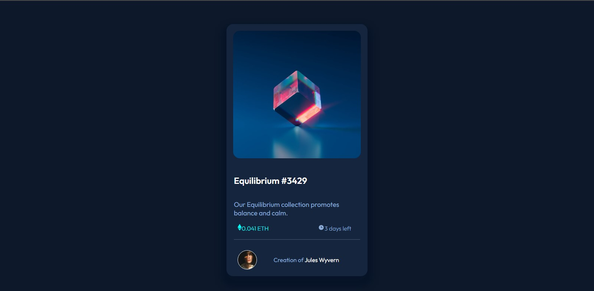

# Frontend Mentor - NFT preview card component solution

This is a solution to the [NFT preview card component challenge on Frontend Mentor](https://www.frontendmentor.io/challenges/nft-preview-card-component-SbdUL_w0U). Frontend Mentor challenges help you improve your coding skills by building realistic projects. 

## Table of contents

- [Overview](#overview)
  - [The challenge](#the-challenge)
  - [Screenshot](#screenshot)
  - [Links](#links)

  - [Built with](#built-with)
  - [What I learned](#what-i-learned)
  - [Continued development](#continued-development)
  - [Useful resources](#useful-resources)
- [Author](#author)
- [Acknowledgments](#acknowledgments)

**Note: Delete this note and update the table of contents based on what sections you keep.**

## Overview

### The challenge

Users should be able to:

- View the optimal layout depending on their device's screen size
- See hover states for interactive elements

### Screenshot

### Links

- Solution URL: (https://github.com/KBModib/nft_preview_card.git)
- Live Site URL: [Add live site URL here](https://your-live-site-url.com)

### Built with

- Semantic HTML5 markup
- CSS custom properties
- CSS Grid

### What I learned

My biggest takeaway from doing this project was how the smallest typo can halt the code from running properly. I am seeing that I can do this and this project has really built my confidence, especially with CSS grids.

The most exciting parts of this project were seeing the elements that need to hover, hover and my horizontal line finnaly being in the correct position.

### Continued development

I need to get into the habit of consistent coding and developing an order with my work. I would like to explore the features of the CSS grids and flexbox more. I would also like to learn how to use the javascript to render my code and will definitely be doing so in my future projects.

### Useful resources

(https://www.youtube.com/watch?v=9bGbykdR4T8&t=1s) - This helped me with the hover function of the preview cards.
- Stack overflow is my new best friend.

## Author

- Website - [Kamogelo Modibedi]
- Frontend Mentor - [@KBModib](https://www.frontendmentor.io/profile/KBModib)

## Acknowledgments

I made reference to Achuyat-Joy's (https://github.com/Achuyat-Joy) repository to perfect my work and I'm very grateful for his work. I would also like to thank Njabulo Magudulela (github profile unknown) for being a sounding board throughout the process.
